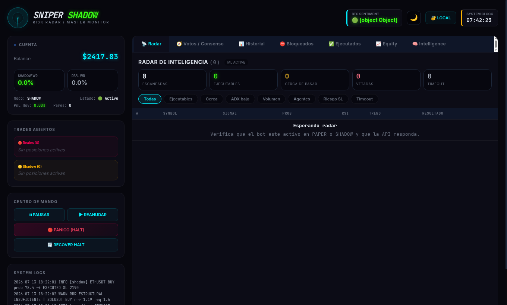
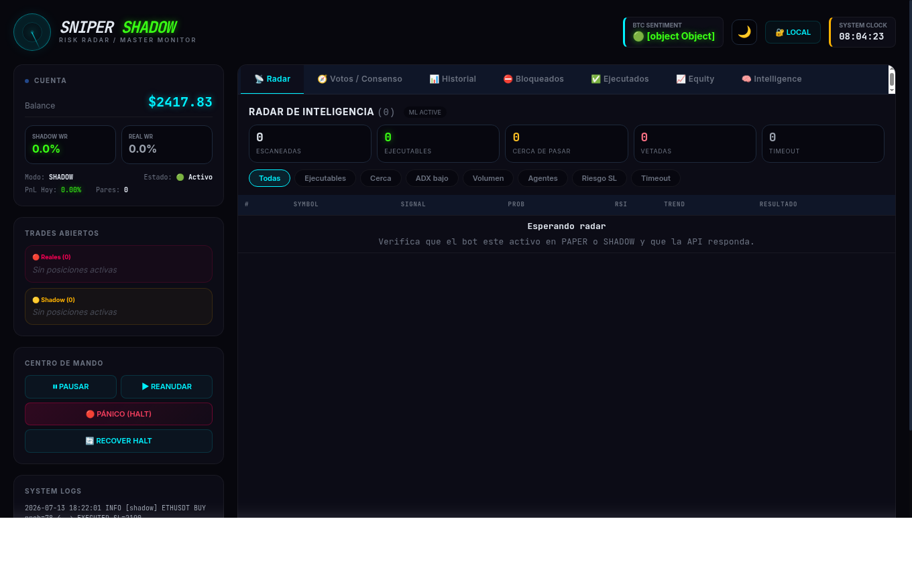

<div align="center">

# 🤖 Sniper AI — Pbot V5ARCH DEV Clean

### *Bot cuantitativo runtime-first para Binance Futures, endurecido para operación segura*

> Inteligencia de mercado con HMM Markov · Escaneo dinámico 1H · Ejecución segura · Shadow Lab · Reconciliación defensiva

---

[](https://python.org)
[](https://binance.com)
[]()
[](https://github.com/Rukawua26/Pbot-V5ARCH-DEV-clean/actions)

[](https://github.com/Rukawua26/Pbot-V5ARCH-DEV-clean)
[]()
[]()
[]()
[]()
[]()
[]()
[]()

</div>

---

## 📖 ¿Qué es Sniper AI?

**Sniper AI** es un bot de trading cuantitativo diseñado para operar en **Binance Futures** con un enfoque *runtime-first*: cada decisión, ejecución y reconciliación ocurre en una arquitectura modular, trazable y segura.

Combina regímenes de mercado via **HMM Markov**, filtros multi-temporalidad, motor de agentes y un laboratorio *shadow* para explorar sin arriesgar capital real.

### ✅ Estado Actual del Build

| Check | Estado |
|---|---|
| `unittest discover` | ✅ `1259 tests OK` · `2 skipped` |
| `ruff` | ✅ Sin errores en archivos tocados |
| `compileall main.py core` | ✅ OK |
| `check_no_silent_pass.py` | ✅ OK |
| `mypy --explicit-package-bases core` | ✅ OK |
| `pip-audit --strict` | ✅ Sin vulnerabilidades conocidas |
| `coverage report --fail-under=75` | ✅ **78%** |
| `docker build -t sniper-ai .` | ✅ OK |
| Runtime safety | ✅ HARD SL, locks, reconciliación y deploy hardening revisados |
| Portable packaging | ✅ Windows `.zip` y Linux `.tar.gz` vía GitHub Releases por tag `v*` |

> Esta rama limpia elimina módulos huérfanos, corrige riesgos de concurrencia y deja el runtime preparado para validación CI/producción.

```
Binance Futures → Triage Dinámico → HMM BTC → Agentes MT/SR/G
       → Filtros (OI · CVD · MTF · SHOCK) → Decisión → Ejecución
       → Telemetría · Reconciliación · Telegram
```

---

## ✨ Últimas Fases

### 📦 Phase 23 — Portable Windows/Linux Releases (Julio 2026)
Distribución portable multiplataforma estilo RustDesk:

| Área | Resultado |
|---|---|
| Rutas portables | Windows `%APPDATA%\SniperBot`, Linux `~/.config/SniperBot` |
| Wizard inicial | Crea `.env`, detecta IP pública y arranca siempre en `PAPER` |
| Seguridad | `ALLOW_REAL_TRADING=false` por defecto; REAL no se activa desde wizard |
| Persistencia | DB, logs, modelos y backups fuera del directorio temporal de PyInstaller |
| Packaging | PyInstaller `onedir`, `console=True`, dashboard estático incluido |
| Releases | Workflow `.github/workflows/release.yml` genera Windows `.zip` y Linux `.tar.gz` al pushear tags `v*`

### 🛡️ Phase 24 — Runtime Safety Hardening + Safe-Fill (Julio–Ago 2026)
Endurecimiento crítico del runtime tras validación de fills REAL, validación de ACK HARD SL y protección contra estados ambiguos:

| Cambio | Descripción |
|---|---|
| `execute_order` fail-safe | Reconciliación inmediata contra `fetch_positions()`; cero con exposición → HALT; fills parciales terminales → protección + HALT; ACK sin order ID → HALT (`ENTRY_ORDER_ID_UNVERIFIED`) |
| Validación HARD SL | `hard_sl_ack_looks_valid` exige: `id` activo, estado `open`/`new`, tipo `STOP_MARKET`, `reduceOnly=true`, cantidad con tolerancia relativa; rechaza status terminal/bool/nonfinite |
| `_fetch_exchange_position_amount` | Rechaza snapshots malformados y cantidades contradictorias (`contracts` vs `positionAmt` con o sin `side`) → `None` (unknown) |
| Persistencia REAL | Falla de persistencia final activa `is_paused`, `integrity_lock_active` y `halt_system_active` |
| `close_trade` fail-safe | En bloque `except` de cierre REAL asume `close_failed = True` (fail-safe) y solo revierte a `False` si el exchange confirma posición plana |
| CI hardening | Pin `actions/setup-python@v5` a SHA `a26af69be951a213d495a4c3e4e4022e16d87065`; errores mypy resueltos con narrowing `raw_info`; tests herméticos (`tests/test_dashboard_ipc.py`, `tests/test_min_atr_filter.py`) |

<div align="center">

</div>

<div align="center">

</div>

<div align="center">

</div>

### Capturas del dashboard

<div align="center">

</div>

<div align="center">

</div>

---

### 📊 Diagramas de flujo validados

- **Arquitectura global**: visión completa de módulos y flujos de datos críticos.
- **Flujo de llenado seguro**: pasos fail-safe desde fill hasta reconciliación y HALT.
- **Guardia HARD SL + reconciliación**: detección de estados ambiguos y activación de HALT.

---

### 📈 Resultados tras endurecimiento

- **1259 tests OK** · **78% coverage** · **Docker build OK**.
- **Gates de CI**: Ruff, format, compileall, `check_no_silent_pass`, smoke imports, suite completa, chaos matrix, recovery drill.
- **Riesgo residual**: estados `REAL` ambiguos ahora fuerzan `HALT` + reconciliación antes de continuar, sin degradación silenciosa.
- **Validado en**: PAPER y SHADOW con flags `FVG_TRACKER_ENABLED`, `GLOBAL_MARKET_PROVIDER_ENABLED`, `SHADOW_VALIDATION_ENABLED`.

--- |

### 🧱 Phase 22 — FVG Tracker + Idempotencia de Salidas + Readiness (Junio 2026)
Endurecimiento incremental sin activar nuevas decisiones de trading por defecto:

| Área | Resultado |
|---|---|
| FVG Tracker | Detector read-only apagado por defecto con persistencia local y alertas opcionales |
| Idempotencia | Writes críticos de salida recuperan por `clientOrderId` tras timeout ambiguo |
| Coverage crítico | `trade_exit` 78%, `ghost_agent` 83%, `orchestrator` 95%, `shocks` 89%, `consensus_nn` 79% |
| Dependencias | `msgpack` actualizado por `pip-audit` |
| Pending Improvements Readiness | Script `tools/pending_improvements_readiness.py` + runbook `paper-shadow-observation.md` |
| Validación | 1259 tests OK · 78% coverage · chaos/recovery/Docker OK · readiness OK |

### 🛡️ Phase 21 — Runtime Safety + CI Closure (Junio 2026)
Sweep de seguridad y validación completa antes de publicar en GitHub:

| Área | Resultado |
|---|---|
| HARD SL | Estados ambiguos en open orders ahora fuerzan `HALT` en vez de duplicar órdenes |
| Reconciliación | Posiciones huérfanas solo persisten `OPEN` tras confirmar HARD SL |
| Locks | Account/exchange calls serializadas y lock inversion corregida |
| Config REAL | `EXECUTION_BACKEND` validado y guardrails REAL unificados |
| ML/Data | Split temporal cronológico con embargo y optimizer legacy bloqueado por defecto |
| Dashboard | API canónica `tools.dashboard_api_server`; legacy duplicado retirado |
| Dependencias | `aiohttp`, `cryptography` y `starlette` actualizados; `pip-audit` limpio |
| Validación | 949 tests OK · 75% coverage · Docker build OK |

### 🧠 Phase 20 — Intelligence Layer + Dashboard Consultivo (Junio 2026)
Nueva capa consultiva, separada del runtime crítico, integrada en el dashboard:

| Área | Resultado |
|---|---|
| `tools/intelligence/` | Ingesta read-only de `execution_events`, `state_snapshot` y DB del bot |
| Reportes | `daily_report`, `weekly_report`, `postmortem` y `advisories` persistidos |
| Dashboard | Nueva pestaña `Intelligence` con KPIs, advisories, annotations y lookup de postmortem |
| SHADOW | Comparativa `SHADOW vs REAL` para calibración consultiva |
| Seguridad | Sin impacto sobre órdenes, SL, reconciliación, watchdog ni recovery |

> Esta capa no participa en el path de ejecución. Si falla, el bot sigue operando igual.

### 🔵 Phase 19 — Kanban GitHub Projects (Junio 2026)
Integración **async no-bloqueante** con GitHub Projects v2 para el ciclo de vida completo de operaciones:

| Columna Kanban | Significado |
|---|---|
| 🟡 `Estrategias Activas` | Señal detectada, buscando entrada |
| 🟠 `Órdenes Pendientes` | Orden limit/stop esperando en el exchange |
| 🟢 `Posiciones Abiertas` | Trade activo con PnL en vivo |
| ⚫ `Historial de Cierre` | Operación finalizada con resultado |

### 🟢 Runtime Clean — Dead Code + Safety Sweep (Junio 2026)
Limpieza profunda orientada a estabilidad operativa:

| Área | Resultado |
|---|---|
| Código muerto | Eliminados módulos/agentes huérfanos no registrados |
| Concurrencia | Protegidos accesos a `active_trades`, `scanner_history`, cooldowns y balance |
| Shutdown | Señalización defensiva con `_shutdown_event` y cierre de executors |
| Seguridad | Pickle seguro, subprocess con path validado y timeout |
| Validación | 891 tests OK · `ruff` OK · mypy core OK |

### 🟣 Phase 18 — Hardening Técnico (Junio 2026)
Consolidación del runtime sin deuda legacy:

| Área | Cambio |
|---|---|
| 🗑️ Imports legacy | Retiro de wrappers raíz deprecated |
| 📊 Dashboard | Ruta canónica `tools.dashboard` con import lazy |
| 🧠 RAG Memory | `find_similar_contexts` vectorizado con NumPy |
| 💾 Maturity cache | Hash-debounce + persistencia async |
| 🗄️ DB path | `core.learning_paths.DEFAULT_DB_PATH` como fuente única |
| ✅ Validación | 891 tests · compileall · ruff · mypy core · silent-pass guard |

### 🟡 Phase 17 — Recalibración SHADOW (Mayo 2026)
Ajuste de umbrales para operar en régimen RANGE:

| Parámetro | Antes | Después | Efecto |
|---|---|---|---|
| `SHADOW_MODE_MIN` | 50% | **55%** | Umbral shadow más selectivo |
| `SHOCK_MIN_DIST_PCT` | 0.40% | **0.20%** | Menos vetos en mercado lateral |
| `HMM_RANGE_PENALTY` | 0.50x | **0.80x** | Penalización más suave en RANGE |
| Breakout penalty | 0.85x | **0.95x** | Mínima penalización sin breakout |
| `MAX_ENTRY_SL_PCT` | 2.50% | **3.0%** | Límite operativo balanceado |

---

## 🧬 Inteligencia Markov

El motor HMM clasifica el régimen de BTC y publica un snapshot en memoria con probabilidades de transición. Los filtros lo usan como **regulador de confianza**, no como interruptor ciego.

```json
{
  "state": "RANGE",
  "confidence": 0.72,
  "bullish_breakout_prob": 82.0,
  "bearish_reversal_prob": 12.0,
  "range_prob": 6.0,
  "model_version": "hmm_markov_v1"
}
```

| Señal Markov | Acción del sistema |
|---|---|
| `RANGE` + breakout alto | Penalización leve — señal fuerte puede llegar a `REAL` |
| `RANGE` estándar | Penalización media — degrada a `SHADOW` |
| `RANGE` estancado | Penalización estándar — no veto total |
| Tendencia alineada fresca | Boost controlado a la probabilidad final |
| Snapshot expirado | Solo puede penalizar, nunca boostear |

---

## ⚡ Ventajas Operativas

| Módulo | Descripción |
|---|---|
| 🧬 **HMM Markov** | Probabilidades de transición `BULL` · `BEAR` · `RANGE` en tiempo real |
| ⚡ **Kinetic SR** | Z-score + cinética de velas: boost ×1.3 en absorción, penalty ×0.7 en falling knife |
| 👻 **Shadow Lab** | Hasta 20 operaciones paralelas sin tocar capital real |
| 🛡️ **OI Delta** | Veta short squeezes y long liquidations antes de ejecutar |
| 🧭 **MTF 15m/5m** | Confirmación multi-temporalidad sin quitar ownership al `1h` |
| 🔬 **CVD Order Flow** | Agresores `aggTrade` para detectar presión compradora/vendedora real |
| 📉 **Correlación dinámica** | Reduce position size cuando las apuestas abiertas se mueven juntas |
| 🧪 **Auto-tuning régimen** | Ajusta SL/TP por régimen con mínimos de muestra y límites duros |
| 💰 **Spread dinámico** | BULL 0.10% · BEAR 0.08% · RANGE 0.05% por régimen HMM |
| 🧾 **Audit trail JSONL** | Trazabilidad de señal → filtro → fill → protección |
| 📡 **WebSocket BTC** | Precio en vivo con fallback REST y logging de reconexión |
| 📲 **Control Telegram** | Auditoría, inteligencia y control remoto en tiempo real |

---

## 🎮 Modos de Operación

| Modo | Variable | Comportamiento |
|---|---|---|
| 🟦 `PAPER` | `PAPER_MODE=true` | Capital virtual. Valida conectividad si hay credenciales. |
| 🟥 `REAL` | `PAPER_MODE=false` | Requiere credenciales válidas. Errores de auth abortan el arranque. |
| 👻 `shadow_live` | `EXECUTION_BACKEND=shadow_live` | Runtime real con latencia, rechazo y slippage simulados. |
| 🧪 `TESTNET` | `USE_TESTNET=true` | Sandbox de Binance para validación sin capital real. |

---

## 🚀 Inicio Rápido

```bash
# 1. Clonar el repositorio
git clone https://github.com/Rukawua26/Pbot-V5ARCH-DEV-clean.git
cd Pbot-V5ARCH-DEV-clean

# 2. Crear entorno virtual e instalar dependencias lockeadas
python3.12 -m venv .venv
source .venv/bin/activate
python -m pip install --upgrade pip
python -m pip install -r requirements.lock

# 3. Configurar variables de entorno
cp .env.example .env
# Editar .env con tus credenciales y modo de operación

# 4. Arrancar el bot
./.venv/bin/python main.py
```

> ⚠️ Para modo `REAL`, completa primero los checks de `docs/runbooks/real-trading.md` y `docs/runbooks/recovery.md`.

---

## 📦 Portables Windows / Linux

Los paquetes portables se publican en **GitHub Releases** cuando se pushea un tag `v*`.

| Sistema | Archivo | Primer arranque |
|---|---|---|
| Windows | `SniperBot-Windows-Portable.zip` | Ejecutar `SniperBot.exe`; crea `%APPDATA%\SniperBot\.env` |
| Linux Ubuntu/Debian/Arch moderno | `SniperBot-Linux-Portable.tar.gz` | Ejecutar `./SniperBot`; crea `~/.config/SniperBot/.env` |

El wizard portable siempre genera configuración segura:

```env
PAPER_MODE=true
ALLOW_REAL_TRADING=false
EXECUTION_BACKEND=live
```

### Windows

```powershell
# Descargar desde Releases, extraer zip y ejecutar:
.\SniperBot.exe
```

Para desarrollo con Python instalado:

```bat
packaging\windows\start_bot.bat
```

### Linux

```bash
tar -xzf SniperBot-Linux-Portable.tar.gz
cd SniperBot
./SniperBot
```

Para desarrollo con Python instalado:

```bash
bash packaging/linux/start_bot.sh
```

### Crear un Release

```bash
git tag v118.8-PRO
git push origin v118.8-PRO
```

Esto dispara `.github/workflows/release.yml` y sube ambos artefactos al Release.

---

## 📊 Dashboard

El bot arranca automáticamente el dashboard en `http://127.0.0.1:8000`.  
Muestra: estado runtime · trades activos · radar de señales · logs en vivo · intelligence consultiva.

### Dashboard + Intelligence

- Pestaña `🧠 Intelligence` con resumen diario y semanal.
- `Advisories` persistidos desde la capa consultiva.
- `Trade annotations` generadas desde histórico + contexto.
- `Postmortem lookup` por `trade_id`.
- Botón `⚙ Generar` para regenerar reportes desde la UI.
- Botón `PM` en el historial de trades para abrir el postmortem del trade.

Variables útiles:

```bash
export SNIPER_API_KEY="tu_clave_larga_y_segura"
export SNIPER_DASHBOARD_AUTOSTART=1
export SNIPER_INTELLIGENCE_AUTOSTART=1
export SNIPER_INTELLIGENCE_STARTUP_DELAY_SECONDS=12
export SNIPER_INTELLIGENCE_REFRESH_SECONDS=1800
```

Arranque recomendado:

```bash
SNIPER_API_KEY="tu_clave_larga_y_segura" ./.venv/bin/python main.py
```

URL local:

```text
http://127.0.0.1:8000
```

```bash
# Iniciar manualmente
bash dashboard/run.sh
```

Generación manual por CLI:

```bash
./.venv/bin/python -m tools.intelligence.report_daily
./.venv/bin/python -m tools.intelligence.report_weekly
./.venv/bin/python -m tools.intelligence.postmortem 123
```

---

## 🏗️ Arquitectura del Runtime

```
main.py
  └─▶ core.bot_app.run_entrypoint()
        └─▶ Bot(BotFacade)
              └─▶ bootstrap · servicios · modelos · loops
```

### Módulos Clave

| Módulo | Función |
|---|---|
| `core/bot_app.py` | Bootstrap, clase `Bot`, event loop y wiring |
| `core/bot_facade.py` | Contrato público del runtime |
| `core/bot_connection.py` | Conexión a Binance por modo operativo |
| `core/bot_guardian.py` | Vigilancia de posiciones activas |
| `core/reconciliation.py` | Recovery DB/exchange al arranque |
| `core/execution_adapters.py` | Backends `live` y `shadow_live` |
| `core/trade_entry.py` | `execute_order` — ejecución de entrada |
| `core/trade_exit.py` | `close_trade` — cierre de posición |
| `core/trade_helpers.py` | Emergency close · MARKET fallback · precondiciones |
| `core/risk_engine.py` | RiskEngine · daily drawdown · sizing |
| `core/risk_policy.py` | `EntryRiskDecision` · protección runtime |
| `core/cycle_context.py` | Snapshot inmutable por ciclo de scan |
| `core/intent_deduper.py` | Dedup de señales por ventana temporal |
| `core/config/manager.py` | Fuente canónica de configuración |
| `core/config/thresholds.py` | `ThresholdSpec` con 30+ umbrales tipados |
| `core/signals/filters.py` | Filtrado y ruteo por modo de ejecución |
| `core/strategy/orchestrator.py` | Orquestador de agentes MT · SR · G |

---

## 🛡️ Seguridad Runtime

> **Principio fundamental:** El exchange manda sobre la DB para exposición real y estado de órdenes.

- 🔒 Ninguna posición real queda sin `HARD SL`.
- 🚨 Si el SL no puede adjuntarse (`-2021: would trigger immediately`), se ejecuta **Emergency Market Close**.
- 🔍 `LOST_IN_TRANSMISSION` solo se declara tras verificar posiciones activas, órdenes abiertas y `origClientOrderId`.
- ⛔ Estado ambiguo → comportamiento esperado es `HALT` + reconciliación antes de continuar.
- 🧱 CI bloquea `pass` silenciosos en `core/` mediante guardrail automático.

### Estados de Orden/Trade

```
PENDING_SEND → PENDING_EXCHANGE_OPEN → ENTRY_FILLED_AWAITING_POSITION_SYNC → OPEN → CLOSING_INITIATED
```

---

## 🔧 Fases de Hardening Runtime

| # | Descripción | Estado |
|---|---|:---:|
| 1 | Circuit Breaker diario UTC solo para `REAL` | ✅ |
| 2 | Position sizing por distancia al Stop Loss | ✅ |
| 3 | Validación walk-forward para modelos | ✅ |
| 4 | Market Breadth con veto LONG en `FEAR` | ✅ |
| 5 | Filtro macro HMM + telemetría de pipeline | ✅ |
| 6 | Shadow ampliado + matriz táctica validada | ✅ |
| 7 | HMM Markov como regulador probabilístico | ✅ |
| 8 | Dead zone Markov → penalización estándar | ✅ |
| 9 | Escudo de liquidez: spread 0.05% · radar 30 pares | ✅ |
| 10 | Filtro OI Delta contra squeezes/liquidaciones | ✅ |
| 11 | Límite de triaje end-to-end (`v118.4-PRO`) | ✅ |
| 12 | `SCAN_INTERVAL=300` — 12 llamadas API/hora | ✅ |
| 12.1 | Correlación dinámica como reducer de tamaño | ✅ |
| 12.2 | Auto-tuning SL/TP por régimen | ✅ |
| 12.3 | CVD Order Flow por WebSocket `aggTrade` | ✅ |
| 13 | `v118.5-PRO`: CycleContext · IntentDeduper · risk policy | ✅ |
| 14 | Emergency close unificado + limpieza código muerto | ✅ |
| 15 | MTF regime-aware + spread dinámico por régimen | ✅ |
| 16 | Kinetic SR: boost ×1.3 absorción · penalty ×0.7 falling knife | ✅ |
| 17 | Recalibración SHADOW: umbrales 55% · SHOCK 0.20% · RANGE 0.80x | ✅ |
| 18 | Hardening técnico: legacy retirado · RAG NumPy · tests ampliados | ✅ |
| 19 | GitHub Projects v2 Kanban async — ciclo vida de operaciones | ✅ |
| 20 | Intelligence Layer + Dashboard consultivo | ✅ |
| 21 | Runtime Safety + CI Closure: audit, coverage y Docker OK | ✅ |
| 22 | FVG tracker read-only + idempotencia de salidas + coverage crítico | ✅ |
| 24 | Runtime safety hardening + safe-fill: fills REAL fail-safe, validación ACK HARD SL, protección estados ambiguos, close_trade fail-safe, CI pin/mypy/hermetic tests | ✅ |

---

## 📋 GitHub Projects Kanban

```bash
# Inicializar tablero
./.venv/bin/python tools/bootstrap_github_project_kanban.py \
  --owner Rukawua26 \
  --repo Rukawua26/Pbot-V5ARCH-DEV
```

Ver tablero: `https://github.com/users/Rukawua26/projects`

Funciones disponibles en `tools/github_projects_kanban.py`:
- `crear_tarjeta_operacion()` · `mover_tarjeta()` · `actualizar_pnl_tarjeta()`

---

## ⚙️ Variables de Configuración Principales

| Variable | Descripción | Default |
|---|---|---|
| `PAPER_MODE` | Alterna modo paper/real | `true` |
| `ALLOW_REAL_TRADING` | Habilita capital real | `false` |
| `EXECUTION_BACKEND` | `live` o `shadow_live` | `live` |
| `MAX_SHADOW_TRADES` | Máx. trades shadow concurrentes | `20` |
| `HMM_REGIME_ENABLED` | Filtro de régimen BTC HMM | `true` |
| `MTF_FILTER_ENABLED` | Confirmación 15m/5m | `false` |
| `OI_FILTER_ENABLED` | Filtro Open Interest Delta | `true` |
| `CVD_FILTER_ENABLED` | CVD rolling por aggTrade | `false` |
| `CORRELATION_RISK_ENABLED` | Reducer por correlación | `false` |
| `REGIME_TUNING_ENABLED` | Auto-tuning SL/TP | `true` |
| `FVG_TRACKER_ENABLED` | Tracker FVG read-only; no participa en ejecución | `false` |
| `FVG_MAX_SYMBOLS_PER_CYCLE` | Límite de símbolos FVG por ciclo | `20` |
| `GLOBAL_MARKET_PROVIDER_ENABLED` | Proveedor macro CoinGecko read-only | `false` |
| `GLOBAL_FEAR_GREED_FILTER_ENABLED` | Veto por Fear & Greed extremo | `true` |
| `GLOBAL_BTC_DOM_FILTER_ENABLED` | Boost SELL por dominancia BTC | `true` |
| `SIGNAL_AGENT_OVERRIDE_ENABLED` | Dirección por consenso de agentes | `true` |
| `EXIT_RANGE_ACTIVATION_MULT` | Trailing más permisivo en RANGE | `1.5` |
| `EXIT_RANGE_BREAKEVEN_PULLBACK_MULT` | Pullback de breakeven en RANGE | `2.0` |
| `TOP_TRIAGE_COUNT` | Universo de pares a escanear | `30` |
| `TELEGRAM_TOKEN` | Token del bot de Telegram | — |

> Configuración completa en `.env.example`. La fuente canónica es `core/config/manager.py`.

---

## 🚀 Despliegue

### Local
```bash
./.venv/bin/python main.py
```

### systemd (recomendado para VPS)
```bash
bash tools/install_watchdog_systemd.sh
systemctl --user status sniper-ai.service --no-pager
```

### Docker
```bash
docker compose up --build -d
```

Build manual verificado:

```bash
docker build -t sniper-ai .
```

---

## 📊 Operación Diaria

| Tarea | Comando |
|---|---|
| Ver estado | `systemctl --user status sniper-ai.service --no-pager` |
| Iniciar | `systemctl --user start sniper-ai.service` |
| Detener | `systemctl --user stop sniper-ai.service` |
| Logs en vivo | `journalctl --user -u sniper-ai.service -f` |
| Dashboard | `http://127.0.0.1:8000` |

---

## 📲 Comandos Telegram

| Categoría | Comandos |
|---|---|
| 🎛️ **Control** | `/on` `/off` `/pause` `/resume` `/panic` `/closeall` `/reset` |
| 🔍 **Auditoría** | `/status` `/open` `/targets` `/signals` `/pipeline` `/shadow_stats` |
| 🧠 **Inteligencia** | `/thinking` `/explain <symbol>` `/dna <symbol>` `/agents` `/intelligence` |
| 📈 **Rendimiento** | `/paper_review` `/performance_trends` `/shadow_report` `/audit_report` |

---

## ✅ Validación Mínima (alineada con CI)

```bash
# Compilación
./.venv/bin/python -m compileall -q main.py core

# Imports modulares
PATH="./.venv/bin:$PATH" bash scripts/smoke_modular_imports.sh

# Guardrails
./.venv/bin/python tools/check_no_silent_pass.py

# Contratos de arquitectura
SNIPER_DISABLE_FILE_TELEMETRY=1 ./.venv/bin/python tools/regression_contracts.py

# Runtime safety drills
SNIPER_DISABLE_FILE_TELEMETRY=1 ./.venv/bin/python tools/chaos_matrix.py
SNIPER_DISABLE_FILE_TELEMETRY=1 ./.venv/bin/python tools/recovery_drill.py

# Suite completa de tests
SNIPER_DISABLE_FILE_TELEMETRY=1 ./.venv/bin/python -m unittest discover -s tests -p "test_*.py"

# Invarianza temporal
SNIPER_DISABLE_FILE_TELEMETRY=1 ./.venv/bin/python -m unittest tests/test_temporal_invariance.py

# Dependencias y seguridad
./.venv/bin/python -m pip check
./.venv/bin/python -m pip_audit --strict

# Cobertura mínima y contenedor
SNIPER_DISABLE_FILE_TELEMETRY=1 ./.venv/bin/python -m coverage run -m unittest discover -s tests -p "test_*.py"
./.venv/bin/python -m coverage report --fail-under=75
docker build -t sniper-ai .
```

**Estado verificado:** `1259` tests OK · `2` skipped · `78%` coverage · `pip-audit` limpio · Docker build OK · readiness OK.


**Coverage ratchet:** gate actual `fail-under=75`; siguiente objetivo `80%` priorizando `bot_guardian`, `bot_cycles`, `bot_io_loops`, `bot_runtime_monitor` y `data_service`.

> 💡 **Nuevo:** Ejecuta `tools/pending_improvements_readiness.py` antes de activar flags de observación en PAPER/SHADOW para validar que tu configuración está lista.

---

## 🧪 REAL Pilot

El bot opera en modo REAL en Binance Futures con capital controlado:

| Parámetro | Valor |
|---|---|
| 💵 Capital | $24.90 USDT |
| ⚖️ Riesgo por trade | 0.3% |
| 📊 Trades simultáneos máx. | 2 |
| 🔧 Apalancamiento | 1x |
| 🛑 Límite pérdida diaria | 5% |
| 🔒 HARD SL | −3.0% |

```bash
bash tools/start_real_pilot.sh   # Arrancar
bash tools/stop_real_pilot.sh --confirm-real-stop    # Detener tras verificar posiciones/SL
```

---

## 📁 Estructura del Proyecto

```
Pbot-V5ARCH-DEV/
├── main.py                     # Entrypoint (delega en core.bot_app)
├── core/
│   ├── bot_app.py              # Bootstrap y clase Bot
│   ├── bot_facade.py           # Contrato público del runtime
│   ├── bot_guardian.py         # Vigilancia de posiciones
│   ├── reconciliation.py       # Recovery DB/exchange
│   ├── execution_adapters.py   # Backends live y shadow_live
│   ├── trade_entry.py          # execute_order
│   ├── trade_exit.py           # close_trade
│   ├── risk_engine.py          # RiskEngine y sizing
│   ├── risk_policy.py          # EntryRiskDecision
│   ├── config/
│   │   ├── manager.py          # Fuente canónica de config
│   │   ├── operational.py      # load_dotenv + defaults
│   │   └── thresholds.py       # 30+ umbrales tipados
│   ├── signals/                # Filtros y ejecución de señales
│   └── strategy/               # Agentes MT · SR · G
├── tests/                      # 1259 tests unittest
├── tools/                      # Herramientas de análisis y validación (incl. readiness)
├── deploy/systemd/legacy/      # Unidades systemd históricas
├── docs/runbooks/              # Guías operativas
└── docker-compose.yml
```

---

## 📚 Documentación

| Archivo | Contenido |
|---|---|
| [`CHANGELOG.md`](CHANGELOG.md) | Historial de versiones y cambios |
| [`CONTRIBUTING.md`](CONTRIBUTING.md) | Guía para contribuidores |
| [`SECURITY.md`](SECURITY.md) | Política de seguridad |
| [`SPEC.md`](SPEC.md) | Especificación técnica del sistema |
| [`BOT_TECHNICAL_ROADMAP.md`](BOT_TECHNICAL_ROADMAP.md) | Hoja de ruta técnica |
| [`docs/engineering/memoria-tecnica.md`](docs/engineering/memoria-tecnica.md) | Memoria tecnica de cambios, decisiones y guardrails |
| [`docs/roadmap/mejoras-pendientes.md`](docs/roadmap/mejoras-pendientes.md) | Backlog tecnico y mejoras pendientes |
| [`docs/runbooks/real-trading.md`](docs/runbooks/real-trading.md) | Checklist de activación REAL |
| [`docs/runbooks/recovery.md`](docs/runbooks/recovery.md) | Procedimientos de recuperación |
| [`docs/runbooks/chaos-validation.md`](docs/runbooks/chaos-validation.md) | Matriz de fallos de exchange |
| [`docs/runbooks/risk-governance.md`](docs/runbooks/risk-governance.md) | Prioridad de decisiones de riesgo |
| [`docs/runbooks/hmm-stuck-range.md`](docs/runbooks/hmm-stuck-range.md) | Fallos de lógica HMM/RANGE |
| [`docs/runbooks/drawdown-while-trading.md`](docs/runbooks/drawdown-while-trading.md) | Drawdown mientras sigue operando |
| [`docs/runbooks/high-confidence-no-entry.md`](docs/runbooks/high-confidence-no-entry.md) | Señales fuertes sin entrada |
| [`docs/runbooks/shadow-real-divergence.md`](docs/runbooks/shadow-real-divergence.md) | Divergencia SHADOW vs REAL |
| [`docs/runbooks/github-projects-kanban.md`](docs/runbooks/github-projects-kanban.md) | Guía Kanban |
| [`docs/runbooks/paper-shadow-observation.md`](docs/runbooks/paper-shadow-observation.md) | Validación de mejoras pendientes en PAPER/SHADOW |

---

## 🔒 Seguridad del Repositorio

> ⛔ **Nunca subas:** `.env` · bases `.db` · logs · modelos binarios · reportes con datos locales.

- Usa variables de entorno o un gestor de secretos para credenciales.
- Antes de operar en `REAL`: valida permisos Futures, tamaño de cuenta y rutas de recovery.
- El token de GitHub debe rotarse regularmente y nunca hardcodearse.

---

<div align="center">

**Sniper AI** · `v118.7-PRO` · Phase 21 · Binance Futures · Python 3.12+

*Construido con enfoque en seguridad runtime, trazabilidad total y exploración sin riesgo.*

</div>
